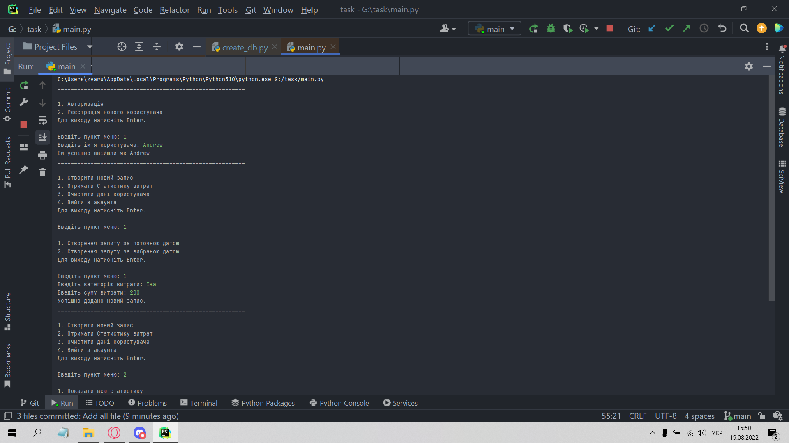
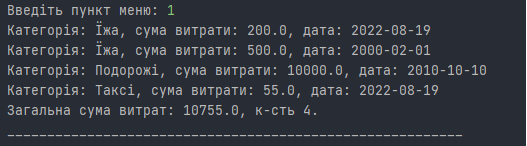

# Запуск

Для запуску аплцікації потрібно заупустити файл [create_db](create_db.py)

```bash
py create_db.py
```
Для створення Бази Даних. Запускаємо  [main](main.py)
```bash
py main.py
```
# Скріншоти роботи 



